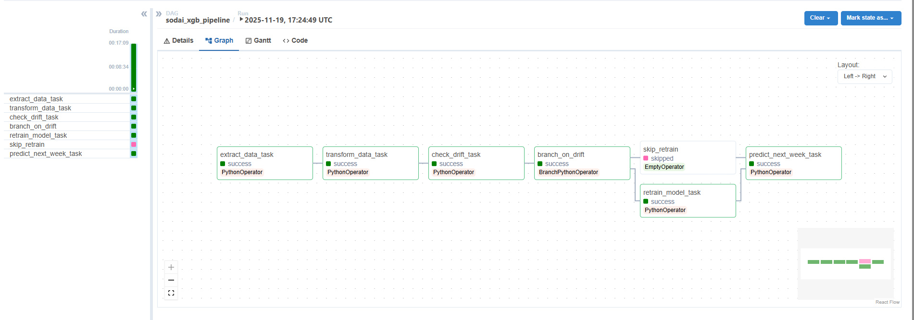

# Documentación del Pipeline MLOps - SodAI Drinks

## Descripción del DAG

El DAG `sodai_xgb_pipeline` es el pipeline productivo que orquesta todo el flujo de ML para predecir compras de productos por cliente. Está diseñado para ser adaptativo, resiliente y eficiente, combinando detección automática de cambios en los datos con reentrenamiento inteligente.

### Tareas del Pipeline

#### 1. Extract Data (`extract_data_task`)

**Funcionalidad:**
- Valida que existan los archivos base requeridos: `clientes.parquet`, `productos.parquet`, `transacciones.parquet`
- Busca archivos nuevos que sigan el patrón `transacciones_*.parquet`
- Marca mediante XCom si hay data nueva disponible

**Por qué es importante:**
Esta tarea me permite saber desde el inicio si tengo nueva información para procesar. Esto determina si voy a generar predicciones para una semana futura o si solo evalúo el modelo actual.

#### 2. Transform Data (`transform_data_task`)

**Funcionalidad:**
- Carga los parquet de clientes, productos y transacciones
- Concatena archivos nuevos con el histórico si existen
- Limpia y deduplica transacciones
- Hace los merge necesarios para tener toda la información consolidada
- Construye el panel semanal por (cliente, producto, semana)
- Genera el target `y` = compra en la semana siguiente
- Expande a cartesiano completo cliente-producto por semana
- Guarda `df_final_latest.parquet`

**Diseño del panel semanal:**
El panel completo me permite capturar tanto las compras como las no compras (que también es información valiosa). Al tener todas las combinaciones posibles, el modelo aprende patrones temporales más ricos.

#### 3. Check Drift (`check_drift_task`)

**Funcionalidad:**
- Carga `df_final_latest.parquet`
- Compara la última semana contra el histórico completo
- Calcula PSI (Population Stability Index) para features numéricas
- Si alguna feature tiene PSI > 0.2, marca drift = True
- Guarda reporte con valores PSI por feature

**Features monitoreadas:**
- `X`, `Y` - Coordenadas geográficas
- `size` - Tamaño del producto
- `num_deliver_per_week`, `num_visit_per_week` - Frecuencia de operación

**Por qué PSI:**
Es una métrica estándar para detectar cambios en distribuciones. Un PSI > 0.2 indica que algo cambió significativamente en el comportamiento de los datos, lo que probablemente afectará la efectividad del modelo.

#### 4. Branch on Drift (`branch_on_drift`)

**Funcionalidad:**
Decide si es necesario reentrenar evaluando tres condiciones:
```python
SI no existe modelo previo:
    → REENTRENAR (primera ejecución)
    
SI llegó data nueva:
    → REENTRENAR (incorporar nueva información)
    
SI detecté drift:
    → REENTRENAR (distribuciones cambiaron)
    
SINO:
    → SKIP (modelo sigue vigente)
```

**Lógica de decisión:**
El balance entre eficiencia y actualidad. Reentreno solo cuando tiene sentido: primera vez, nueva información disponible, o cuando el mundo cambió (drift). Si nada cambió, uso el modelo existente y ahorro recursos.

#### 5. Retrain Model (`retrain_model_task`)

**Funcionalidad:**
- Aplica subsampling según ambiente (dev/staging/prod)
- Split temporal: 36 semanas train, 11 val, resto test
- Optimiza hiperparámetros con Optuna (si está habilitado)
- Entrena XGBoost con pipeline completo
- Busca threshold óptimo que maximiza F1 en validación
- Evalúa en test
- Calcula SHAP values para interpretabilidad
- Registra todo en MLflow
- Guarda modelo + threshold en `xgb_best_model.pkl`

**Pipeline de features:**
```
Numéricas → Imputer + StandardScaler
Categóricas → OneHotEncoder (con min_frequency optimizable)
IDs → Drop
```

#### 6. Skip Retrain (`skip_retrain`)

Tarea vacía que representa la rama donde no se reentrena. Marca que el modelo actual sigue siendo válido.

#### 7. Predict Next Week (`predict_next_week_task`)

**Funcionalidad:**
- Carga modelo y threshold desde `xgb_best_model.pkl`
- Construye candidatos para semana t+2
- Calcula probabilidades de compra
- Aplica threshold para predicciones binarias
- Rankea productos por cliente según probabilidad
- Guarda `predicciones_finales.parquet`

**Trigger Rule:**
Usa `TriggerRule.NONE_FAILED_MIN_ONE_SUCCESS` porque una de las ramas anteriores (retrain o skip) será marcada como skipped por el branch. Esta regla asegura que la tarea corre si al menos una rama fue exitosa.

## Diagrama de Flujo del Pipeline
```
┌─────────────────────┐
│  Extract Data       │
│  - Validar archivos │
│  - Detectar nuevos  │
└──────────┬──────────┘
           │
           ▼
┌─────────────────────┐
│  Transform Data     │
│  - Cargar parquets  │
│  - Limpiar/dedup    │
│  - Panel semanal    │
│  - Target y         │
└──────────┬──────────┘
           │
           ▼
┌─────────────────────┐
│  Check Drift        │
│  - PSI última sem   │
│  - vs histórico     │
└──────────┬──────────┘
           │
           ▼
┌─────────────────────┐
│  Branch on Drift    │
│  ¿Reentrenar?       │
└─────┬─────────┬─────┘
      │         │
      │ NO      │ SÍ
      │         │
      ▼         ▼
┌──────────┐ ┌──────────────────┐
│   Skip   │ │  Retrain Model   │
│ Retrain  │ │  - Optuna        │
└────┬─────┘ │  - XGBoost       │
     │       │  - Threshold     │
     │       │  - MLflow        │
     │       └────────┬─────────┘
     │                │
     └────────┬───────┘
              │
              ▼
    ┌─────────────────────┐
    │  Predict Next Week  │
    │  - Candidatos t+2   │
    │  - Scoring          │
    │  - Ranking          │
    └─────────────────────┘
```

## Representación Visual en Airflow



La interfaz muestra el grafo completo con las 7 tareas conectadas. Se puede ver claramente cómo `retrain_model_task` y `skip_retrain` son ramas paralelas después del branch, y ambas convergen en `predict_next_week_task`.

## Integración de Datos Futuros, Detección de Drift y Reentrenamiento

### Integración de Datos Futuros

El pipeline está diseñado para recibir nuevas semanas de transacciones de forma incremental sin modificar código.

**Convención de archivos:**
- Histórico base: `transacciones.parquet`
- Nuevas semanas: `transacciones_*.parquet` (ej: `transacciones_2024_w52.parquet`)
- Ubicación: `/airflow/data/`

**Flujo de detección:**

Cuando corro el DAG, `extract_data_task` lista los archivos y busca el patrón `transacciones_*`. Si encuentra alguno, marca vía XCom que hay data nueva.

En `transform_data_task`, si hay archivo nuevo, lo concateno con el histórico:
```python
if new_transactions_filename is not None:
    transacciones_new = pd.read_parquet(extra_path)
    transacciones = pd.concat([transacciones_hist, transacciones_new], ignore_index=True)
else:
    transacciones = transacciones_hist
```

Después aplico las mismas transformaciones al dataset completo. El panel semanal se expande automáticamente para incluir la nueva semana con todas las combinaciones cliente-producto.

**Ventajas del diseño:**
- Solo deposito el archivo nuevo, sin cambiar código
- Detección automática
- El histórico nunca se modifica
- Puedo procesar múltiples semanas nuevas a la vez

### Detección de Drift

Uso PSI (Population Stability Index) para detectar cuándo las distribuciones de las features cambiaron significativamente.

**Qué es drift:**
Cambios en las distribuciones que indican que el comportamiento del negocio está cambiando. Por ejemplo: clientes pidiendo productos más grandes, cambios geográficos en demanda, modificaciones en frecuencia de visitas.

**Proceso de detección:**

1. Separo: histórico (todas las semanas menos la última) vs nueva (última semana)
2. Calculo PSI para cada feature numérica relevante
3. Si alguna tiene PSI ≥ 0.2 → drift detectado

**Features monitoreadas:**
```python
numeric_features = [
    "X", "Y",                      # Coordenadas geográficas
    "size",                        # Tamaño del producto
    "num_deliver_per_week",        # Frecuencia de entregas
    "num_visit_per_week",          # Frecuencia de visitas
]
```

Elegí estas porque pueden cambiar por factores externos: expansión geográfica, cambios operativos, preferencias de mercado.

**Cálculo del PSI:**

1. Divido el rango en 10 buckets según cuantiles del histórico
2. Calculo % de datos en cada bucket para histórico y nueva semana
3. PSI = Σ (% histórico - % nuevo) × ln(% histórico / % nuevo)

PSI ≥ 0.2 es el umbral estándar de la industria para cambio significativo.

**Ventajas del PSI:**
- No necesito labels
- Sensible a cambios en la forma de la distribución
- Umbrales bien establecidos
- Computacionalmente barato

**Reporte completo:**
Además de la flag drift sí/no, guardo:
- PSI de cada feature
- Semanas comparadas
- Tamaño de los grupos
- Umbral usado

### Lógica de Reentrenamiento

La decisión está en `branch_on_drift` con tres triggers:
```python
# Caso 1: No existe modelo
if not model_exists:
    return "retrain_model_task"

# Caso 2: Nueva data
if has_new_data:
    return "retrain_model_task"

# Caso 3: Drift detectado
if drift_flag:
    return "retrain_model_task"

# Caso 4: Modelo vigente
return "skip_retrain"
```

**Razonamiento:**

**Caso 1 - No existe modelo:**
Primera ejecución, necesito modelo inicial.

**Caso 2 - Nueva data:**
Decidí reentrenar siempre con nueva data porque:
- Patrones recientes son más informativos en series de tiempo
- Cada semana nueva da ejemplos que el modelo no vio
- El costo es manejable con los ambientes configurables
- Más conservador: prefiero modelo actualizado que arriesgarme a que quede obsoleto

**Caso 3 - Drift:**
Si las distribuciones cambiaron, el modelo predice sobre un mundo diferente. Reentrenar es necesario para mantener calidad.

**Caso 4 - Vigente:**
Sin cambios, uso el modelo actual. Ahorro recursos sin sacrificar calidad.

**Ventana temporal:**
```
Train: primeras 36 semanas
Val: siguientes 11 semanas
Test: resto
```

Simula el escenario real: entreno con pasado, ajusto con periodo intermedio, evalúo en futuro reciente. Cuando llega nueva data, la ventana se desliza naturalmente.

**Optimización por ambiente:**
```
DEV: Hiperparámetros fijos (rápido)
STAGING: Optuna 20 trials (balance)
PROD: Optuna 30 trials (mejor modelo)
```

**Threshold dinámico:**
No solo reentreno el modelo, también recalculo el threshold óptimo. Barrido de 40 valores entre 0.05 y 0.80, elijo el que maximiza F1 en validación.

**Beneficios del diseño completo:**

1. **Automatización** - No decido manualmente cuándo reentrenar
2. **Adaptabilidad** - Se ajusta solo a cambios
3. **Eficiencia** - No desperdicio recursos
4. **Trazabilidad** - Cada decisión queda registrada
5. **Flexibilidad** - Fácil agregar más condiciones

El diseño es conservador pero no paranoico. Reentreno cuando tiene sentido, reacciono a cambios, pero no en cada ejecución innecesariamente.